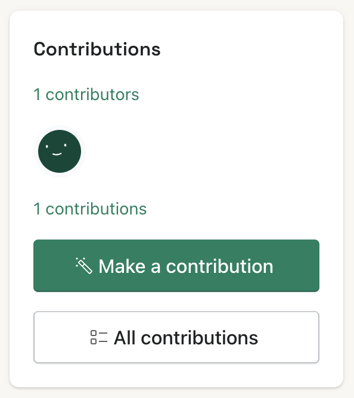
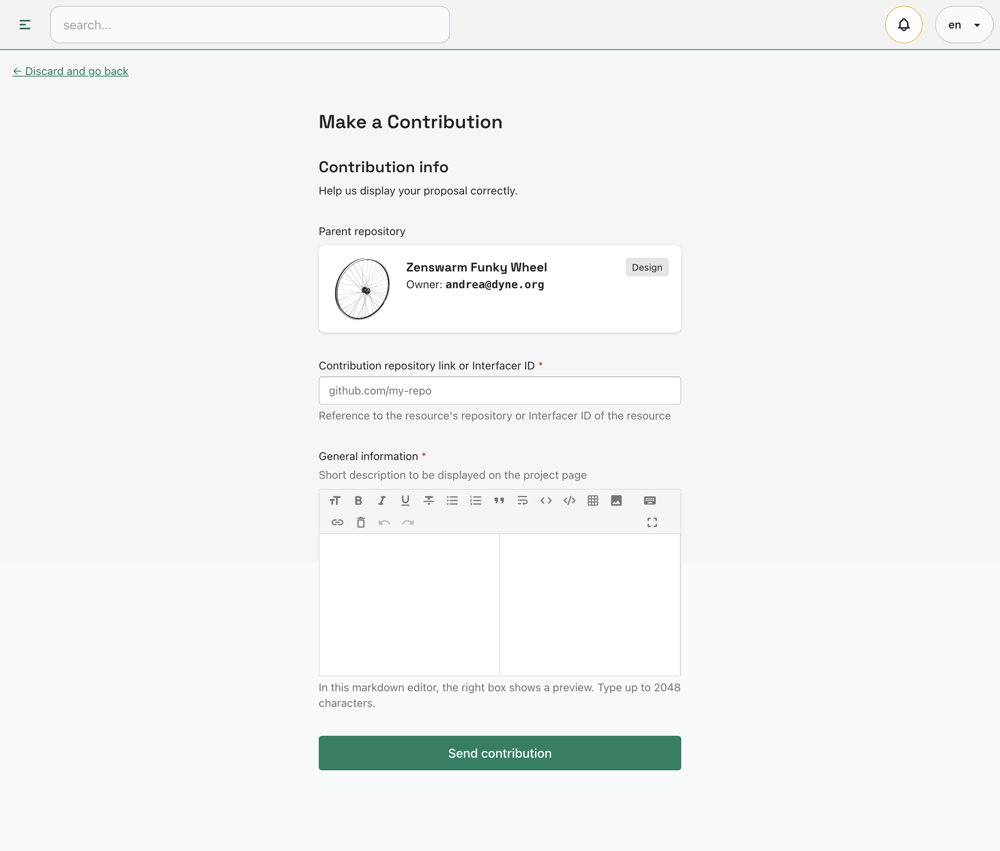

# Contributions
Contributions are a key aspect of open source hardware projects. They allow users to collaborate with project owners by making suggestions, providing feedback, or contributing to the project's codebase, documentation, or design files. 

It's important to note that when you contribute to a project, you are agreeing to the project's license and terms of use. Be sure to carefully read and understand these terms before contributing.

## Make a contribution

To make a contribution, simply navigate to the project's page and look for the "**_Make a contribution_**" button. 

From there, you can choose how you'd like to contribute and submit your contribution for review. Once your contribution is accepted, it will be merged into the project's codebase or added to the project's documentation or design files. 

Remember to follow the project's guidelines and best practices when making contributions, and be respectful of the project owner's time and resources.

### Project owner response

#### Contribution Accepted

**Once you've contributed to a project, you'll be listed as a contributor on the project page**, and the project owner will receive a notification about your contribution. You can also see a list of all the projects you've contributed to on your profile page. 

#### Contribution Rejected
If your contribution to a project has been rejected by the project owner, it's important to understand that there can be many reasons for this. The project owner may have specific requirements or standards that they're trying to maintain, or they may simply not have the resources to accept every contribution. 

Regardless of the reason, you can use this as an opportunity to learn and improve your skills. Keep in mind that the rejection of your contribution doesn't necessarily mean that you can't continue to contribute to the project in other ways.

[replace image]

If your contribution has been rejected by the project owner, don't worry! **As a contributor, you have the right to create your own project based on the original project** (as long as the original project's license allows it). This way, you can still use your ideas and work towards the advancement of open source hardware. And who knows, your new project may even attract more collaborators and users.

## Review contributions (for project owners)
As a project owner, you have the ability to review and accept or reject contributions made by other users to your project. This allows you to maintain control over the development of your project and ensure that contributions align with your goals and vision.

**When a user makes a contribution to your project, you will receive a notification and can review the changes they have proposed.** You can then either accept the changes and merge them into your project, or reject them if they don't align with your goals or vision for the project.

If a contribution is rejected, the contributor still has the option to create their own project based on your original project, provided that the license allows for derivative works. This can foster continued collaboration and development within the open source hardware community.
