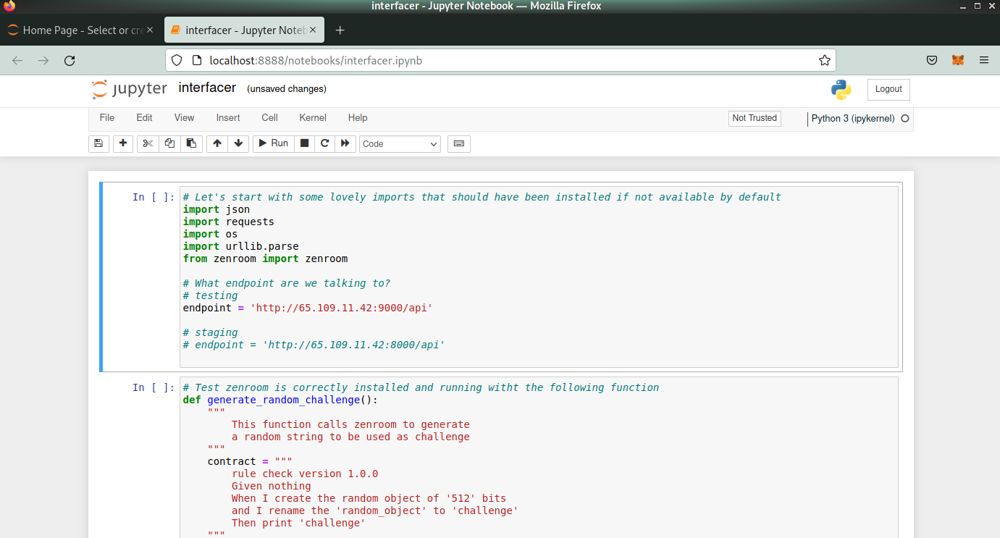

# Digital Product Passport

The Digital Product Passport (DPP) is a tool that allows users to keep track of important information about their open hardware project, such as its design, components, and production processes. With the DPP, users can easily share information about their project with others and ensure that everyone has access to accurate and up-to-date information.

Additionally, the DPP can be used to track the [relationships](../../pages/user-manual/add-project?id=relations-connect-several-projects-into-a-new-one) between different open hardware projects, allowing users to easily identify dependencies and potential areas for collaboration.

The European Commission is investing heavily in the standardization of the DPP, but a general standard is still far away in the future. Therefore, for a DPP to be widely adopted, it has to be generic enough, easy to operate and interoperable.

Our DPP data structure is based on the ValueFlows ontology and is produced by the [Zenflows back-end](../../pages/zenflows.md), which is programmable in GraphQL. ValueFlows is flexible enough to accommodate most **economic flows, actors, processes and events**.

Such a power and flexibility, come with an inherently high level of complexity: in order to tackle complexity and minimize uncertainties in the development, we implemented a workflow to prototype complex GraphQL queries and flows using Jupyter Notebook, this allows us and third party developers to accelerate development and:
* Extract data from Zenflows, to be imported into different data structures and systems
* Inject data into Zenflows, from an ERP, an IoT device, a mobile application
* Visualize complex data structures

Interactive data visualization [here!](https://interfacerproject.github.io/Interfacer-notebook/)

<!--
## JSON - ValueFlows

https://valueflo.ws/

## Graphic
-->

