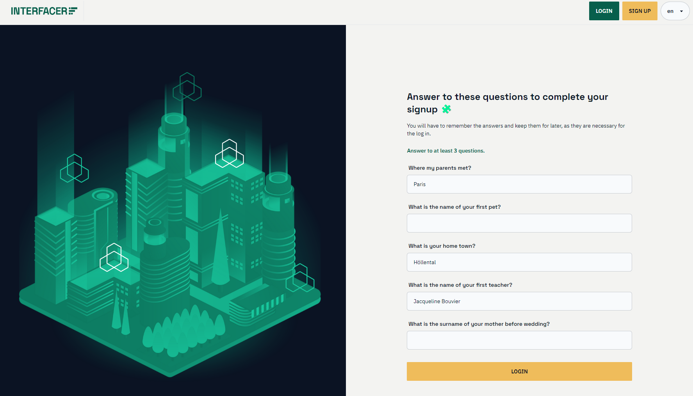

<!--- Future manual, page by page	

 
 --->

# Intro

Welcome to Interfacer. 
On the landing page you can click on **sign in** to sign-in (if you haven't yet created a user) or sign-up.

# Top bar

- **Menu button**: on your left you will always fing the menu button that, when tapped, it opens the left side menu

- **Search bar**: you can use the search bar for finding other projects and other people based on their name and keywords contained in their description text.

- **Notifications**: internal notification system, used for sending and receiving collaboration requests and updates about the projects you decide to follow

- **Language preferences**: At any time, you can easily change your language preferences. Nevertheless, the translations are automatic, not perfect and a continues community effort where support is needed

 

# Projects
Create, share, and collaborate on your open source hardware projects using our user-friendly creation form. With fields for project title, description, tags, images, and documentation, you can provide all the necessary information for others to understand and contribute to your project. Plus, with features like version control, licensing options, and project updates, you can ensure that your project is always up-to-date and accessible to a global community of makers, designers, and engineers.

More in the [Add Project](/pages/user-manual/add-project) section

## Design, Products, Services

Designs, products, and services are the three types of projects that can be created on our platform. A design is a documented plan or schematic for making a product, while a product is a physical item made according to a design. A service, on the other hand, is a non-physical offering that provides a solution or meets a need. When creating a project, users can choose the appropriate type based on the nature of their work. Additionally, users can search for and discover these projects on our platform using various search criteria, such as tags, users, location, and more.

More in the [Add Project](/pages/user-manual/add-project) section

# Sign-in

The sign-in page offers you three options: 
 - Sign up
 - Sign in: passphrase 
 - Sign in: answer questions

## Sign-up 

When signing up, you have to type in a valid email, your name and a username

### Sign-up questions

Next, you need to answer as many (at least 3) of these 5 questions: it's important that you choose the questions and the answers carefully, as those can later be used to sign in the platform.

### Sign-up passphrase

After typing your answers, the platform will return you a **mnemonic passphrase** that you should store somewhere safe as you can later to use it sign-in the platform (from the a different browser or device, or if your browser storage is deleted).

## Sign-in for existing users

After you have created a user, you can sign in from a different device (or browser) 

- **Sign-in: passphrase** by entering your email and using your stored passphrase 

- **Sign-in: answer questions** if you don't have your passphrase, you can entering your email and answer to the questions in the same way you did when you first signed-up.

## Under the hood: sign-up process explained

The sign up process producess a set of crytpographic private and public keys, as well as a passphrase:
- The ***private keys*** are **stored in the browser storage** (and never communicated with the server)
- The ***public key*** is **communicated to the server**
- The ***passphrase*** is something you should to **store somewhere safe**

If the private key is not there (cause you are logging in from a different device/browser or you have deleted the history of your browser), **the passphrase can be used as a substitute to the private key** to sign-in the platform.

Behind the sign-up process is the cryptographic flow [Keypairoom](https://github.com/dyne/keypairoom/).
